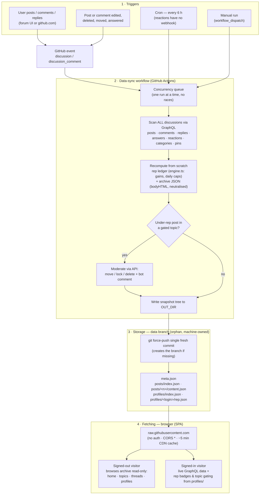

# Data syncing

One GitHub Actions workflow — [`data-sync.yml`](../.github/workflows/data-sync.yml) running [`data-sync.ts`](../.github/scripts/data-sync.ts) — maintains everything on the machine-owned `data` branch: the [reputation](reputation.md) files and the [read-only archive](archive.md). This page walks the full pipeline from a user action to the data landing back in someone's browser.

## The flow

## Why "recompute from scratch"?

Every run rescans the whole forum and rebuilds every file, instead of incrementally patching:

- **Idempotent** — two runs over the same forum state produce byte-identical output, so concurrent or repeated triggers can never corrupt anything; the concurrency queue just serialises pushes.
- **Lossless under load** — GitHub keeps at most one queued run per concurrency group. With incremental updates a superseded run would mean lost events; with recompute, whichever run lands last has everything.
- **Self-healing** — deleted posts stop being counted and archived automatically; a failed run is fully repaired by the next one.

## Why snapshot force-pushes?

The branch holds only derived, recomputable data, so its git history has no value. Each run commits one fresh snapshot and force-pushes it:

- The branch stays at **one commit forever** — no repo bloat from thousands of tiny data commits.
- Stale files (deleted posts, renamed users) vanish because the whole tree is rewritten.
- A force-push to a branch that doesn't exist **creates it** — which is the entire bootstrap story. No manual setup, no seed commit.

## Interaction with branch protection

`main` keeps its rulesets (PRs, tests, 100 % coverage) untouched — the workflow never pushes there. The `data` branch is an orphan with no shared history, so the two can never be merged into each other accidentally. If your rulesets target *all* branches rather than `main`, exclude the data branch or add an Actions bypass, otherwise the workflow's push is rejected.

## Freshness

| Path | Latency |
| --- | --- |
| Post/comment/edit events | workflow runtime (~30–60 s) + raw-URL CDN cache (~5 min) |
| Reactions & upvotes | next 6-hourly cron (no webhook exists for them) |
| Manual dispatch | same as events |
